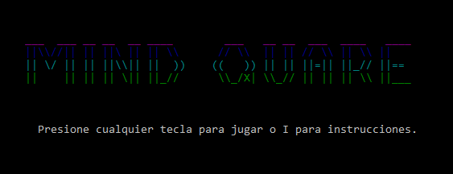
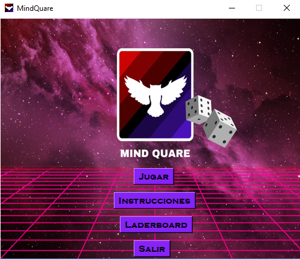
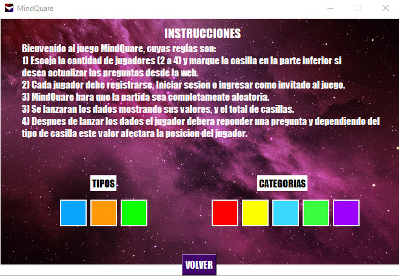
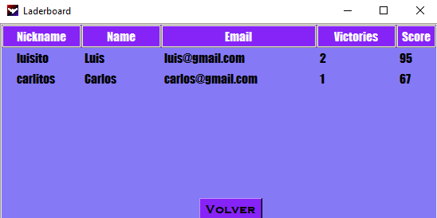
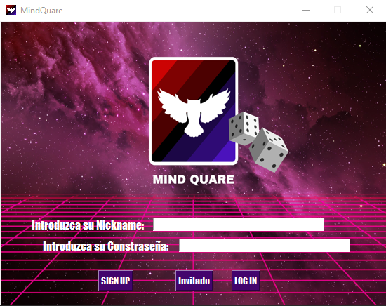
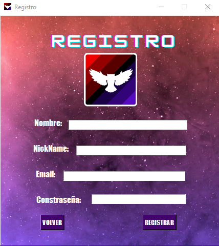
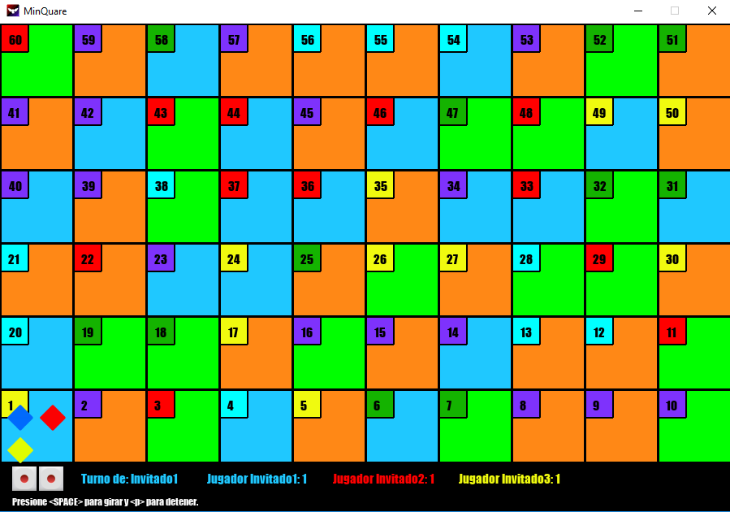
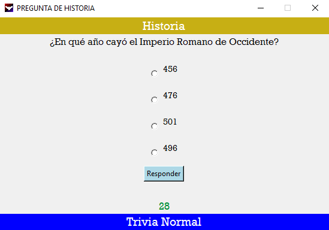

# Mind Quare V.1.0 
 Juego interactivo de preguntas con tablero.
 Grupo #1
 
### Integrantes
    -Camilo Andres Cuello
    -Juan Andres Orozco
    -Santiago Ospina

Universidad Nacional de Colombia.

### Objetivo 
Videojuego en base a el lenguaje de programación Python :snake:, su temática es la de un juego de preguntas divididas por categorías donde los participantes deberán ir avanzando por un tablero lanzando los dados, dependiendo de la casilla en la que el jugador se sitúe habrá un efecto sobre la partida del mismo. 

### Contenido
_Nota: El juego completo puede ejecutarse mediante MindQuare.bat_

-"demo.py" Demo de consola que incluye la logica y funcionamiento del juego en la consola cmd.
 

-"VentanaInicio.py" Ventana principal del juego para ver las instracciones, laderboard o ingresar al juego
 
 
 

-"Cantidad_p.py" Ventana para escoger la cantidad de jugador y la opcion de actualizar o no las preguntas desde la web
 

-"LogIn.py" Login y registro para iniciar sesion y asi guardar el puntaje del jugador o ingresar como invitado
 
 

-"tablero.py" interfaz y logica completa del juego
 

-"VentanaPreguntas.py" Ventana que muestra las preguntas por categoria con un tiempo limite

-"getQuestions.py" Obtener las respuestas y preguntas desde el sitio web: https://camilo-neck.github.io/MindQuare-Web/ 

### Requisitos
Para el correcto funcionamiento de MindQuare se requieren la instalacion las siguientes librerias que no se encuentran instaladas por defecto:📋
_Se requiere de sistema operativo windows puesto que se incluyen funciones especificas de la consola cmd_

Demo de consola:
-colorama : 
pip install colorama==0.4.4

MindQuare:
-pygame : 
pip install pygame==2.0.0.dev18 
-tkinter : 
pip install tk==0.1.0
-bs4 :
-pip install bs4==0.0.1

###### _Ejecutar el archivo requirements.py para descargar e instalar estas librerias._

### Instrucciones del juego

1) Escoja la cantidad de jugadores (2 a 4) y marque la casilla en la parte inferior si desea actualizar las preguntas desde la web.
2) Cada jugador debe registrarse, Iniciar sesion o ingresar como invitado al juego.
3) MindQuare hara que la partida sea completamente aleatoria.
3) Se lanzaran los dados mostrando sus valores, y el total de casillas.
4) Despues de lanzar los dados el jugador debera reponder una pregunta y dependiendo del tipo de casilla este valor afectara la posicion del jugador.
5) El primer jugador en superar la casilla 60 ganara y en este momento los puntajes de los jugadores seran actualizados en el leaderboard

